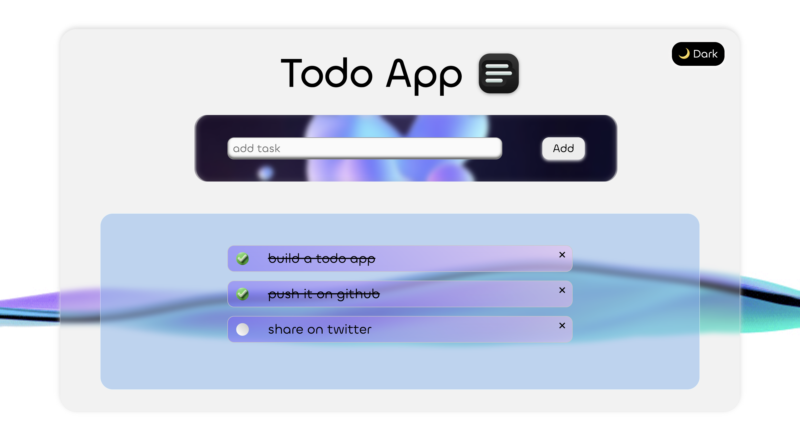
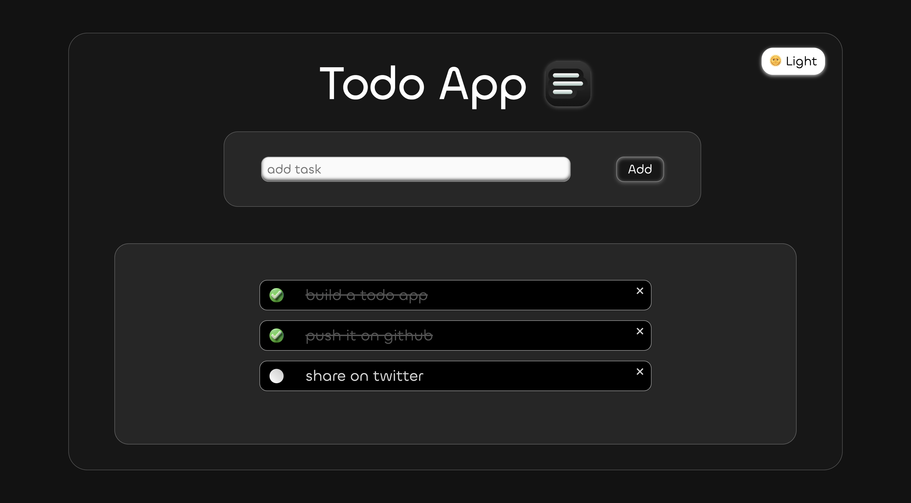

# 📝 Todo App

A simple and elegant **Todo List Web App** built with pure **HTML, CSS, and JavaScript**.  
It includes smooth task management, persistent theme toggle (Light/Dark mode), and a clean UI.

---

## 📸 Screenshots

### ☀️ Light Mode


### 🕶️ Dark Mode



## ⚡ Features
- ➕ Add and delete tasks instantly
- 🌙 Light / Dark mode toggle with local storage memory
- 💾 Automatically saves your list in the browser
- 🧠 Minimal and responsive design

---

## 🛠️ Tech Stack
- **HTML5**
- **CSS3**
- **JavaScript (Vanilla)**

---

## 🚀 Setup
1. Clone this repository:
   ```bash
   git clone https://mohitchauhan-stack.github.io/Todo-App/